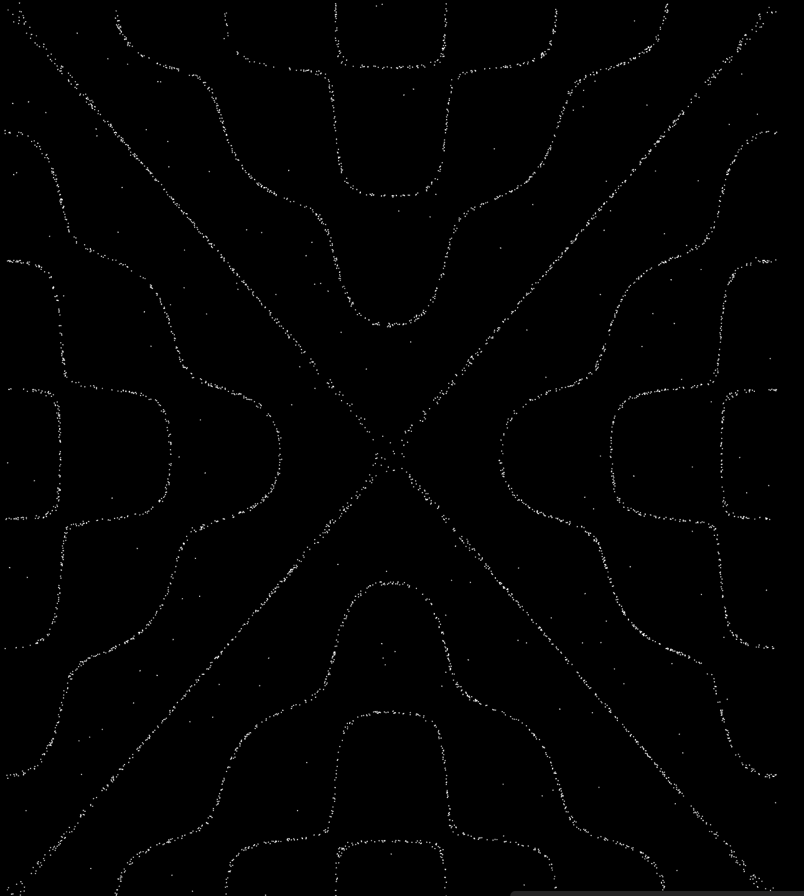
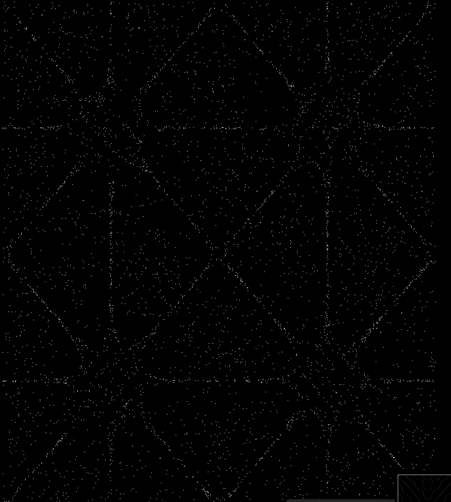

# Particules

To be able to create modular and continuous grids, I followed this tutorial to better understand how I can complete the exercise on [Modules](../Modules/readme.md).

Tutorial link: [Coding Tutorial | Chladni Patterns](https://www.youtube.com/watch?v=J-siGcsK2k8)

- Click to change modular shapes
- Particle formation to create the pattern

