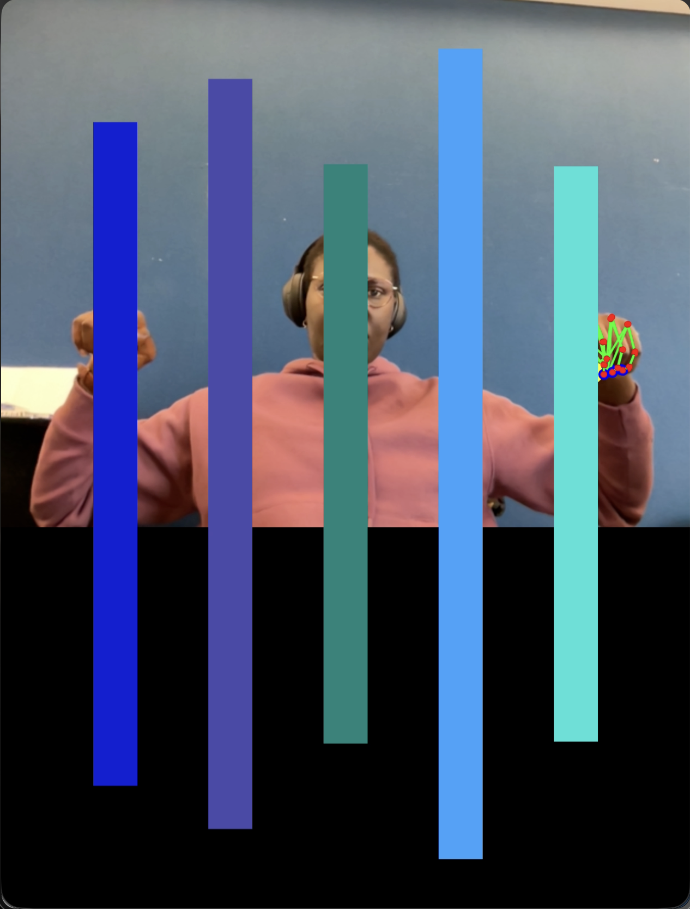

# Exercise with hands

The exercise used hand landmarks. The goal was to increase or decrease the size of the bars using both index fingers.

- Increase or decrease the bars on the screen
- Different bar levels

